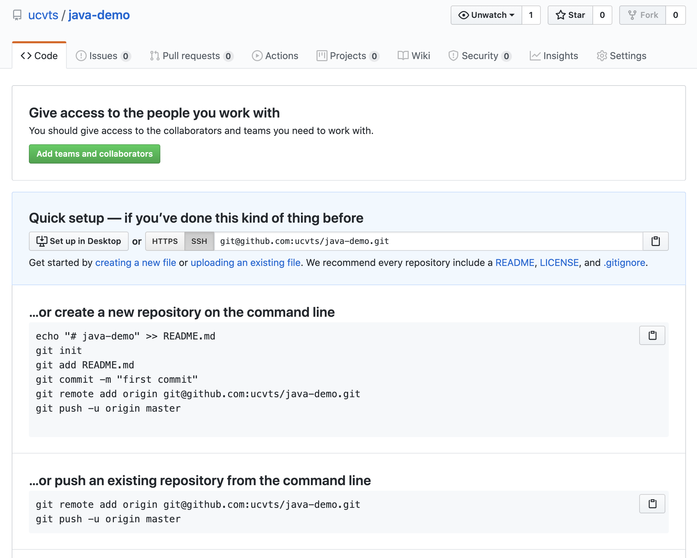

# Git and GitHub

## Git from the Command Line

Git will be a fact of life for at least the remainder of this course \(and well beyond that for those who pursue computer science as a major or future profession\). Whether you love it or hate, it's here to stay. You'll find yourself referencing \(and re-referencing!\) this section often until you know these commands by heart.

Before learning how to use it, you need to take a minute to understand what it is. Git is a distributed version control system whose job is to track changes to files in a specific directory over time. This allows you to revert to past versions as needed, as well as keep your projects in sync when working across different devices or on a distributed team.

Although closely integrated, Git and GitHub are quite different. Remember, GitHub is Google Drive for programmers. It provides cloud storage for your code. Git, among many other things, is the means by which you interact with GitHub. You'll often hear developers refer to local and remote repositories. You can think of a repository as a collection of files and folders. A local repository exists on your own machine, whereas a remote repository exists elsewhere.



### Configurations

Before you start using Git, you need to configure some settings. This is something you'll do the very first time you use Git from the command line.

### Repositories

The concept of repositories is something that is going to permeate the entirety of your development experience in this course. A repository can be thought of as a project directory, but one that tracks all of the changes made inside of that directory.

There are two types of Git repositories: local and remote. A local repository is stored, well, locally on your own computer. A remote repository, on the other hand, is stored externally. This can mean anywhere that is not your own computer, but usually it means a remote server like GitHub.

#### Initializing a Repository

To tell Git to start tracking changes in a directory, you need to turn that directory into a Git repository.

The `git init` command creates a hidden `.git` folder for your project. It's where Git stores all of the things it needs to track your changes. If you want to undo the `git init` command, you need to delete this `.git` folder.

The `.git` folder is gone, and Git is no longer tracking your changes.


Be very, very careful with this. You can permanently trash your repository in a single keystroke!


### Workflow

Git provides different areas in which your files live based on their current state.

* Working tree
* Staging area
* Local repository

You use Git commands to move files between these four states.

* `git status`

The `git status` command shows the current state of the working tree and staging area. It lists any newly created files that are not yet under version control \(i.e., they're untracked\), modifications to tracked files, and files staged for the next commit.

* `git add`

The `git add` command moves untracked files or files that have been modified from the working tree to the staging area. The staging area is where you put files that you want to include in the next commit.

If you run git status again, you'll see that `Utilities.java` and `Helper.java` have been moved to the staging area. `Main.java` is still untracked in the working tree.

* `git commit`

The `git commit` command is equivalent to saving your changes. It creates a commit, which is a saved snapshot of the current state of the files and folders. Commits are stored in the local repository, and are accompanied but the time, author, and a description of the changes being saved.

If you run `git status` for the third time, the committed files are no longer listed. They've been saved to the local repository. The untracked `Main.java` file is still shown.

Using `git status`, `git add`, and `git commit`, you can move your changes between the working tree, staging area, and local repository. There is a fourth area, called the remote repository, and a few more commands, too.



## Integrating with GitHub

The first three areas of the Git workflow—working tree, staging area, and local repository—deal with local changes and file tracking. All of the commands—git status, git add, and git commit—dealt only with local files. So, where does the remote repository come into play? Well, GitHub is that remote repository! Or, rather, it allows us to host remote repositories on its servers.

GitHub gives you the opportunity to upload your code the same way you might upload an essay to Google Drive. Whether you're working on more than one device \(like your desktop at school, and your laptop at home\) or if you're working on a team of many developers, everyone has access to and can download the most up-to-date version of the codebase.



### Pushing and Pulling

To see the fourth workflow area \(and the associated commands\) in action, you'll need to create a remote repository on GitHub.

Login and find the little plus sign near the top-right corner of the page. In the dropdown, select New repository. You'll need to enter a name, an optional description, as well as some privacy and default initialization settings.

When you're done, click the Create repository button. I didn't initialize the `java-demo` repository with a `README`, so there's nothing in it. This is what an empty repository looks like.

The only piece of information I really need is the URL. I selected the SSH form, but either one will work. I'm going to use this to connect my local repository to this remote one.

* `git remote`

The `git remote` command does a few different things based on the usage. With no subcommands, it lists the remote connections you've setup on your local repository. I like to add the `-v` flag to show a little more information. Either way, I haven't setup any remote connections, so this prints out nothing.

The `add` subcommand links this local repository to a remote one using the provided URL.

It doesn't look like it did anything, but on the command line, that's usually a good thing. Run `git remote` again, and you'll see the now-connected remote repository.

There are other subcommands for renaming or removing a remote connection \(called a remote, for short\), setting a new URL, among other things.

* `git remote rename <oldName> <newName>`
* `git remote remove <name>`
* `git remote set-url <name> <newUrl>`

With the remote setup, a few more commands come into play. Namely, `git push` and `git pull`.

* `git push`

The `git push` command is equivalent to uploading the local repository to the remote one. You want to keep these two in sync. So, if you make changes to your local repository, you need to add, commit, and push those changes up to the remote repository.

Remember the `Utilities.java` and `Helper.java` files I added and committed? Time to push them up to GitHub using the `git push` command. 

`origin` is the name of the remote, and `master` is the default branch. If you wanted to push to a different branch, you'd reference it by name. A quick refresh on GitHub, and you'll see the newly pushed files.

For the sake of demonstration, suppose I made a few changes to `Helper.java` directly on GitHub.

The problem that creates is that my remote repository is out-of-sync with my local one.

* `git pull`

The `git pull` command refreshes my local repository by downloaded any changes that have been made to the remote repository that don't exist locally.

Git is telling me that one file, `Helper.java`, was changed \(and that four insertions were made\).

### Cloning a Repository

Now that you know how to initialize a new repository and run through the Git workflow, I want to touch on one more thing: cloning.

* `git clone`

The `git clone` command copies an existing repository into a new one. You get all of the files and folders, as well as the entire commit history. It's a common way to start projects and problem sets in this course.

Git grabs all of the files and folders from the repository located at that URL, and copies them into the `cloned-repo` folder. This folder is created as part of this command. If you navigate into the `cloned-repo` directory, you'll see the two files from the `java-demo` repository.

For more on Git, check out [_Pro Git_](https://git-scm.com/book/en/v2), which covers just about anything you could possibly want to know about Git, GitHub, and version control software.

