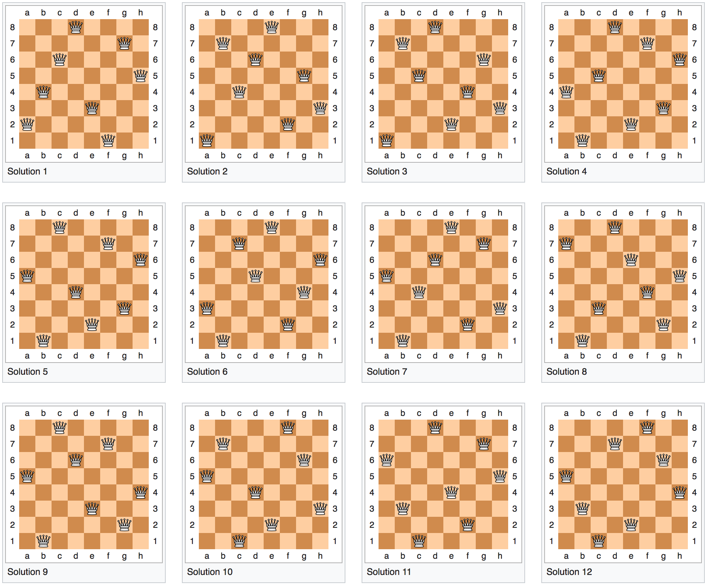

# Logical Puzzles

## Bulbs



There are three light switches in the basement labeled A, B, and C. They are connected to three lightbulbs in the attic labeled X, Y, and Z. You can turn the switches on and off, and leave them in any position you'd like. You start in the basement, and are only allowed one trip upstairs to the attic. How can you reliably determine which switches correspond to which lightbulbs?



Here's a possible solution to this puzzle.

* Turn on the first switch and leave it on for 10 minutes.
* Turn off the first switch.
* Turn on the second switch.
* Go upstairs to the attic.

The bulb that is warmest corresponds to the first switch; the bulb that is lit corresponds to the second switch; the bulb that isn't lit corresponds to the third switch.



## Four Gallons



You have two buckets that can hold exactly three and five gallons of water, respectively. You need to measure out precisely four gallons of water. How can you accomplish this?



Here's a possible solution to this puzzle.

* Fill the 3-gallon bucket to capacity.
* Pour it into the 5-gallon bucket.
* Fill up the 3-gallon bucket again, and pour as much water as you can into the 5-gallon bucket \(at this point, the 5-gallon bucket will be filled to capacity and the 3-gallon bucked will contain 1 gallon of water\).
* Pour all the water out of the 5-gallon bucket.
* Pour the one gallon that is in the 3-gallon bucket into the 5-gallon bucket \(now, the 3-gallon bucket is empty and the 5-gallon bucket contains one gallon\).
* Fill the 3-gallon bucket to capacity and pour it into the 5-gallon bucket.

The 5-gallon bucket now contains exactly four gallons of water.



## Wolf, Goat, Cabbage



You are standing on the bank of a river with a wolf, a goat, and a cabbage. You have a rowboat, and can ferry only one across the river at a time. The wolf will eat the goat if left alone together, and the goat will eat the cabbage if left alone together. How do you get the wolf, goat, and cabbage across the river?



Here's a possible solution to this puzzle.

* Cross the river with the goat.
* Return empty-handed to the wolf and cabbage.
* Cross the river with the cabbage.
* Return with the goat to get the wolf.
* Leave the goat and cross the river with the wolf.
* Return empty-handed to get the goat.
* Cross the river again with the goat.

You've successfully ferried the wolf, the goat, and the cabbage across the river.



## Pigeons on the Stairs



A staircase has 100 steps. On the first step stands a pigeon; on the second, two pigeons; on the third, three; on the fourth, four; on the fifth, five; and so on, on every step up to the hundredth where there are 100 pigeons. What is the simplest way to determine how many pigeons there are altogether?



We can break this problem down into a smaller version. Rather than adding every pigeon from 1 to 100, let's start with every pigeon from 1 to 10. And we'll do so by creating logical pairs.

```text
1 + 10 = 11 (the 1st and 10th step)
2 + 9 = 11
3 + 8 = 11
4 + 7 = 11
5 + 6 = 11  
```

We have five pairs of pigeons whose sums are 11, and 5 x 11 = 55 pigeons. Now, let's scale this up to 100.

```text
1 + 100 (the 1st and 100th step)
2 + 99
3 + 98
...
48 + 53
49 + 52
50 + 51
```

Now, we have 50 pairs of pigeons whose sums are 101, and 50 x 101 = 5,050 pigeons. For the mathematically-inclined, this can be represented by the following formula.





## Towers of Hanoi



You have a stack of five discs, from largest to smallest, that slide onto the first peg of a three-peg board. Your goal is to move the entire stack of discs from the first peg to the third. However, you can only move the topmost disc of any peg, and smaller discs must always be placed on larger discs. What is the minimum number of moves in which this can be done?



For any configuration of _n_-discs, the minimum number of moves is \(for five discs, this is 31 moves\). [Try it out yourself if you'd like](https://www.mathsisfun.com/games/towerofhanoi.html).



## Hat Color



Three women are buried in the sand all facing forwards with their heads above ground. Each woman has a hat placed on her head \(selected from a bag containing three red hats and two black hats\). The women cannot turn around to see behind them, but they can see the woman \(or women\) in front of them. The woman at the back is asked what color hat she is wearing, to which she replies "I do not know." The middle woman is asked what color hat she is wearing, to which she also replies "I do not know". The woman at the front is then asked what hat she is wearing. She replies, "I am wearing a red hat." How did she know?



The last woman could not determine the color of her own hat, which means at least one of the women in front of her was wearing a red hat. The middle woman, therefore, must see a red hat on the woman in front of her; otherwise, she would know that she was wearing a red hat. The first woman, realizing that neither woman behind her can determine the color of her hat, can confidently deduce that she is wearing a red hat.



## Dining Philosophers



Five philosophers sit around a circular table. In front of each philosopher is a large plate of rice. The philosophers alternate their time between eating and thinking. There is one chopstick between each philosopher \(to their immediate right and left\). In order to eat, a given philosopher needs to use both chopsticks. How can you ensure all the philosophers can eat reliably without starving?



If we introduce the concept of a monitoring and queuing system, we can reliably allow all philosophers to eat and guarantee there will never be a situation in which none of the philosophers can eat because they're simultaneously waiting for each other \(i.e., a deadlock situation\).

The monitoring system will atomically determine whether a philosopher is allowed to try to pick up two chopsticks. If a philosopher picks up a chopstick and then realizes a second is unavailable, he or she must put the first chopstick down. Philosophers must inform the monitoring system if they were able to successfully pick up two chopsticks, as well as when they are relinquishing one or more chopsticks.

Every time a philosopher eats, his or her time is recording in the queueing system. With each new round of eating \(i.e., when the philosophers will ask the monitoring system for permission to pick up their chopsticks\), the philosopher with the greatest time since last eating will be moved to the top of the queue and be given priority by the monitoring system.

This is a convoluted and oversimplified analogy of how operating systems work to allocate resources to programs running in parallel.



## Eight Queens



Given eight queens and a standard chessboard \(8 squares by 8 squares\), how many unique positions \(exclusive of rotations and mirror images\) can those eight queens occupy without attacking each other?



There are 12 fundamental solutions to this problem.





## Two Generals



Two armies, each lead by a general, are preparing to attack a city. The armies are encamped outside the city on two mountains separated by a large valley. In order to capture the city, the generals must attack at exactly the same time. The only way for the generals to communicate is by sending messengers through the valley. Unfortunately, the valley is occupied by the city's defenders, so there's a chance any given messenger will be captured. Each general has no way of knowing if their messenger has arrived. How do the generals coordinate their attack?



This one was a trick question. Sorry, not sorry. This problem has no solution. Rather, there exists no algorithm that can guarantee consensus between the generals. This is a classic problem in distributed systems concerning reaching consensus over a lossy network \(i.e., one where messages may be lost\).



## Pirates



Five pirates have obtained 100 gold coins and have to divide up the treasure. The pirates are all extremely intelligent, treacherous and selfish \(especially the captain!\). The captain always proposes a distribution of the loot. All pirates vote on the proposal, which is accepted if at least half the crew votes yes. No pirate is willing to take on the captain without superior force on his side. If the captain fails to obtain support of at least half his crew \(including himself\), he faces a mutiny. All pirates will turn against him and make him walk the plank, after which the pirates start over again with the next senior pirate as captain. What is the maximum number of coins the captain can propose to keep without risking his life?



The captain can be far greedier than you might think. For simplicity, we'll label our pirates A, B, C, D, and E, where A is the captain and E is the lowest-ranking pirate. Pirate A will propose the following distribution of wealth.

```text
Pirate A -> 98 coins
Pirate B -> 0 coins
Pirate C -> 1 coin
Pirate D -> 0 coins
Pirate E -> 1 coin
```

Wait... Surely, the other pirates will not approve this, right? Let's work backwards to see what other deals the pirates might receive.

If Pirates A, B, C are made to walk the plank, only Pirates D and E remain. In this situation, Pirate D would propose the following distribution. He would vote for his own proposal and it would be approved.

```text
Pirate D -> 100 coins
Pirate E -> 0 coins
```

If Pirates A and B are made to walk the plank, only Pirates C, D, and E remain. In this situation, Pirate C would propose the following distribution. Knowing he will receive nothing if Pirate C is mutinied, Pirate E will vote in favor \(as will Pirate C, of course\).

```text
Pirate C -> 99 coins
Pirate D -> 0 coins
Pirate E -> 1 coin
```

If Pirate A is made to walk the plank, Pirates B, C, D, and E remain. In this situation, Pirate B would propose the following distribution. By the same logic as before, Pirate D will vote in favor \(as will Pirate B, of course\).

```text
Pirate B -> 99 coins
Pirate C -> 0 coins
Pirate D -> 1 coin
Pirate E -> 0 coins
```

Now, we've arrived back at the beginning and Pirate A's original proposal will be supported. If Pirates C and E vote against it, they will receive 0 coins in the next proposal. They have no choice but to stand with the captain and accept their minimal share.



