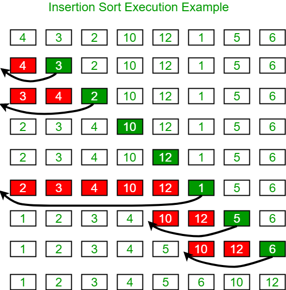

# Sorting


* [Bubble](https://www.geeksforgeeks.org/bubble-sort/)
* [Insertion](https://www.geeksforgeeks.org/insertion-sort/)
* [Selection](https://www.geeksforgeeks.org/selection-sort/)
* [VisuAlgo](https://visualgo.net/en/sorting)


## Bubble

Bubble sort is a very simple sorting algorithm that works by repeatedly swapping adjacent elements that are not ordered correctly. As such, it takes multiple passes through the list to sort it.

Consider the following list.

```text
[ 4, 29, 2, 7 ]
```

During the first pass, the algorithm makes the following comparisons.

* 4 and 29, which are already in order.
* 29 and 2, which are out-of-order. These elements will be swapped, resulting in a new list state.

```text
[ 4, 2, 29, 7 ]
```

* 29 and 7, which are out-of-order. These elements will be swapped, resulting in a new list state.

```text
[ 4, 2, 7, 29 ]
```

Now, the algorithm starts from the beginning again. It'll make the following comparisons.

* 4 and 2, which are out-of-order. These elements will be swapped, resulting in a new list state.

```text
[ 2, 4, 7, 29 ]
```

* 4 and 7, which are already in order.
* 7 and 29, which are already in order.

During the final pass through the list, no swaps need to be made \(because everything is in order\). This tells the algorithm that the list is fully sorted, and its job is done.

### Pseudocode

Later, we'll reveal a Java implementation. For now, pseudocode will have to do.

```text
for each adjacent pair of items
    if the items are out of order
        swap the items
    end if
end for
```

## Insertion

Insertion sort works by selecting one element at a time and moving backwards \(towards the beginning of the list\) until it finds the appropriate slot into which to insert the selected element.



Let's use the following sample list.

```text
[  4, 3,  2,  10, 12, 1, 5, 6 ]
```

For each pass, we'll select an element and locate its rightful spot in the list by comparing values.



### Pseudocode

Let's take a look at who we might implement this. Later, you'll get to see a full Java implementation.

```text
while i is less than the length of the list
    set j = i
    
    while j > 0 and element at j - 1 > element at j
        swap these two elements
        decrease j by 1
    end inner while
    
    increase i by 1
end outer while
```

## Selection

Selection sort, in some ways, is similar to insertion sort. It works by repeatedly finding the minimum element of the unsorted portion of the list, and swapping it with the first element of the unsorted portion of the list.



Let's return to our original list sample.

```text
[ 4, 29, 2, 7 ]
```

At the onset, the sorted portion of the list is empty and the unsorted portion of the list represents the entire list.

The algorithms makes its first pass through the list and identifies 2 as the minimum value. This value is swapped with 4. It now represents the sole element in the sorted portion of the list.

```text
[ 2, 29, 4, 7 ]
```

A second pass \(of the unsorted portion of the list\) identifies 4 as the minimum value. It's swapped with 29, and now there are two elements in the sorted portion of the list.

```text
[ 2, 4, 29, 7 ]
```

The third pass identifies 7 as the minimum value, and it's swapped with 29.

```text
[ 2, 4, 7, 29 ]
```

Since there's only one element left in the unsorted portion, we can assume it's in the right spot and mark the list as sorted.

### Pseudocode

This one is a simpler than it might seem. Have a look.

```text
i = 0
stop = length of list - 1

repeat until i = stop
    locate smallest value between i and stop
    swap these values
    increase i by 1
end repeat
```

## Performance

All three sorting algorithms \(bubble, insertion, and selection\) all have the same complexity:

$$
O(n^2)
$$

Think about it. For each of these algorithms, you potentially need to iterate through all _n_ elements of the list a total of _n_ times.

Next, we'll take a look at an algorithm called merge sort. It is logarithmic in nature \(much like the binary search\), and is much faster than these three.

## Java Implementations

We've seen the pseudocode, and discussed the performance implications. Now, let's take a look at how this would be written in Java.

### Bubble Sort

```java
public void bubbleSort(int[] list) {    
    for (int i = 0; i < list.length - 1; i++) {
        for (int j = 0; j < list.length - i - 1; j++) {
            if (list[j] > list[j + 1]) { 
                int temp = list[j]; 
                list[j] = list[j + 1]; 
                list[j + 1] = temp; 
            }
        }
    }
}
```

### Insertion Sort

```java
public void insertionSort(int[] list) {
    for (int i = 1; i < list.length; ++i) {
        int key = list[i];
        int j = i - 1; 
  
        while (j >= 0 && list[j] > key) { 
            list[j + 1] = list[j]; 
            j = j - 1; 
        } 
        list[j + 1] = key; 
    } 
} 
```

### Selection Sort

```java
public void selectionSort(int[] list) {
    for (int i = 0; i < list.length - 1; i++) {
        int index = i; 
        
        for (int j = i + 1; j < list.length; j++) {
            if (list[j] < list[index]) {
                index = j;
            }
  
            int temp = list[index]; 
            list[index] = list[i]; 
            list[i] = temp; 
        }
    }
}
```



