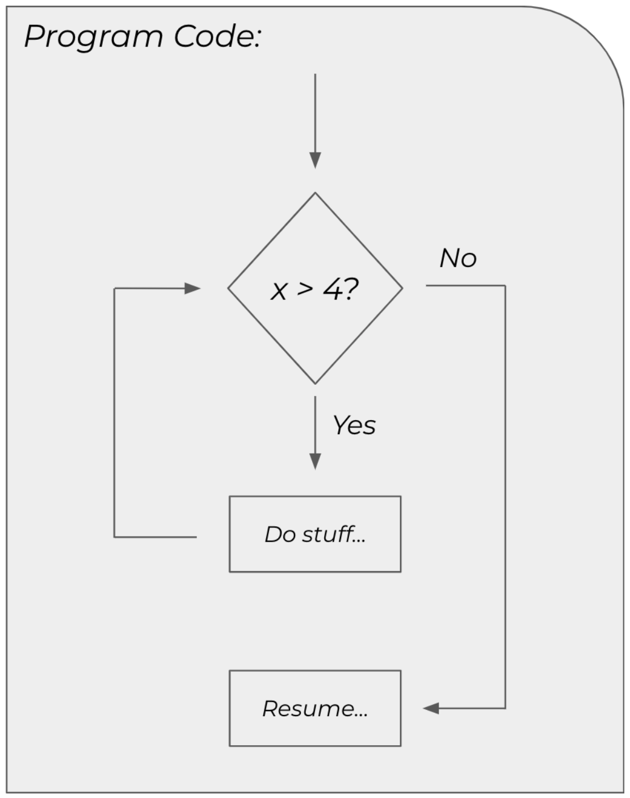

# While Loops


* _Core Java: Volume I—Fundamentals_
  * Chapter 3.8


## Iteration

In much the same way that conditional control structures—`if` statements, `switch` statements, and ternary operators—allow you to conditionally execute one or more instructions, iterative control structures provide a means by which you can execute the same set of instructions repeatedly. There are several iterative control structures in Java. Although you can achieve the same result with each one, there are certain differences that make one a better choice than the others under certain circumstances.

Iteration is just a fancy word for repetition. So, an iterative control structure is a construct in a language that allows you to direct a block of code to execute repeatedly. To start, you'll be working with loops that operate based on some condition.



That means the loop will execute conditionally, which makes it behave like a repeated `if` statement.



## While Loop

Traditionally, the `while` loop is one of two of the most commonly used loops in programming \(the other, the `for` loop, will be discussed in the next section\). Its syntax is quite similar to an `if` statement.

```java
while (condition) {
    // do something repeatedly
}
```

The code between the curly braces will execute repeatedly as long as the condition evaluates to `true`.

### Usage

In practice, it's important that your loops make progress towards satisfying the condition with each iteration \(i.e., execution of the loop\). You need to make sure your loop will terminate at some point.

```java
int x = 5;
int y = 10;

while (x < 10) {
    y = y * x;
    x++;            // this is critical
}

System.out.println(y);
```

The intended purpose of this code is to multiply the value of y with that of x, and reassign the produce to y. If you compile and execute this code, it'll print `151200`. The `x++` statement is critical in the loop. It guarantees that `x` will eventually be greater than or equal to 10, causing the loop to terminate. Try removing that line of code, then compile and run the program.

It kind of just does...nothing. That's because the code is executing endlessly inside of the loop. Without the `x++`, `x` will always be less than 10. This is called an infinite loop. In theory, it runs forever. In reality, it runs until your program runs out of memory and crashes.

Suppose you wanted to print the sum of an unknown number of non-negative integers entered by the user.


```java
import java.util.Scanner;

public class PrintSum {
    public static void main(String[] args) {
        Scanner in = new Scanner(System.in);
        
        System.out.println("Enter non-negative integers.");
        System.out.println("Enter -1 to stop.\n");
        
        int sum = 0;
        int value = 0;
        
        while (value != -1) {
            System.out.print("Enter value: ");
            value = in.nextInt();
            
            if (sum != -1) {
                sum = sum + value;
            }
        }
        
        System.out.println("\nSum: " + sum);
        in.close();
    }
}
```


```text
$ java PrintSum
Enter non-negative integers.
Enter -1 to stop.

Enter value: 1
Enter value: 2
Enter value: 3
Enter value: 4
Enter value: 5
Enter value: 6
Enter value: 7
Enter value: 8
Enter value: 9
Enter value: -1

Sum: 45
```

A `while` loop is a good choice here because you don't know how many values the user will enter, but you need to be able to keep track of them all.

### Scope

Remember, a variable is only accessible in the scope within it was declared. Like conditional statements, this is true of loops, too.

```java
int x = 1;

while (x < 5) {
    int y = x * 5;
    System.out.println(y);    // y is only accessible inside the loop
    x++;
)
// x is accessible here, but y is not
```

If you need to manipulate a variable inside a loop and reference it after that loop terminates, you'll need to make sure it is declared in a scope at least as big as where you intend to reference it.

## Do/While Loop

In many ways, a `do/while` loop behaves the same way as a `while` loop. The syntax, though, looks a little different.

```java
do {
    // do something at least once, and then repeat
} while (condition);
```

Like the `while` loop, the `do/while` loop executes its body as long as the condition evaluates to `true`. However, the `do/while` loop evaluates that condition __after the body executes. This introduces an important functional difference between the two.

```text
while loop                               do/while loop

1. evaluate the loop condition           1. execute the loop body
2. if true, execute the loop body        2. evaluate the loop condition
3. go back to step 1                     3. if true, go back to step 1
```

Because of this difference, a `do/while` loop will always execute its body at least once. If the condition evaluates to `false`, the body still executes on the first iteration because the condition hasn't been evaluated yet. A `while` loop evaluates the condition first; therefore, the body only executes if the the condition evaluates to `true` \(even if this means the body never executes\).

Suppose you wanted to prompt the user to enter a value within a certain range. You'd need to prompt them at least once, and maybe repeatedly if the user didn't initially comply with the specified range.


```java
import java.util.Scanner;

public class PromptRange {
    public static void main(String[] args) {
        Scanner in = new Scanner(System.in);
        
        int value = -1;
        do {
            System.out.println("Enter a value between 0 and 100: ");
            value = in.nextInt();
        } while (value < 0 || value > 100);
        
        System.out.println("\nValue entered: " + value);
        in.close();
    }
}
```


```text
$ java PromptRange
Enter a value between 0 and 100: -50
Enter a value between 0 and 100: 150
Enter a value between 0 and 100: 75

Value entered: 75
```

Because you need to prompt the user the first time, at a minimum, a `do/while` loop is a good fit. Of course, you could have done this with a `while` loop, too, and most programmers probably would opt for this version.


```java
import java.util.Scanner;

public class PromptRange {
    public static void main(String[] args) {
        Scanner in = new Scanner(System.in);
        
        int value = -1;
        while (value < 0 || value > 100 {
            System.out.println("Enter a value between 0 and 100: ");
            value = in.nextInt();
        }
        
        System.out.println("\nValue entered: " + value);
        in.close();
    }
}
```


