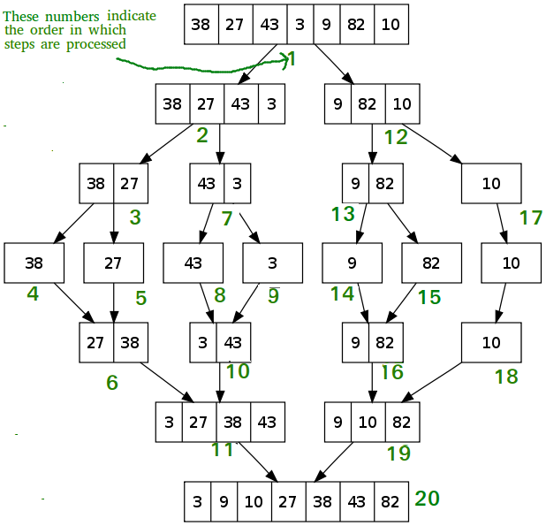

# Recursion


* [Recursion](https://www.geeksforgeeks.org/recursion/)


## What is Recursion?

A method that calls itself is called recursive. You can think of this like placing two mirrors in front of each other. If you stand between these mirrors, you'll see your own reflection over and over.



Unlike the mirrors, though, we can't allow a method to call itself without end. Much like a poorly designed loop, this would go on infinitely until the program crashed. Instead, we can include logic that allows the method to know when to call itself and when to break out of the cycle.

### Factorial

Let's take a look at an example: finding the factorial of a given number. To solve this problem, we can break it down into smaller and smaller subproblems. Let's say we have a method called `factorial` that we're going to call with the argument `5`.



We may not know the answer, but we know the pattern. The factorial of 5 is equal to 5 times the factorial of 4. And the factorial of 4 is equal to 4 times the factorial of 3. This cycle repeats until we reach 1. At this point, there is no matter pattern. The factorial of 1 is equal to 1. This is called our base case, and it what tells us to stop recursing.

```text
factorial(5)
    = 5 * factorial(4)
        = 4 * factorial(3)
            = 3 * factorial(2)
                = 2 * factorial(1)
                    = 1 (base case)
                = 2 * 1 = 2
            = 3 * 2 = 6
        = 4 * 6 = 24
    = 5 * 24 = 120
120
```

Did you follow all that? Think of it like an assembly line. Each call to `factorial` is another person on the assembly line. If they don't know the answer, they pass a smaller version of the problem down the line. The last person on the line \(i.e., the base case\) knows that the factorial of 1 equals 1. From there, each person passes the answer to the subproblem back up the line until we reach the beginning again.

### Implementation

```java
public long factorial(int n) {
    if (n <= 1) {
        return 1;    // base case
    }
    
    return n * factorial(n - 1);    // recursive case
}
```

### Binary Recursion

The Fibonacci Sequence is a great example of binary recursion, which is a recursive method that calls itself twice. We're really down the rabbit hole now. The Fibonacci Sequence is calculated by computing the sum of the two previous digits.

```java
// 1, 1, 2, 3, 5, 8, 13, 21, 34, and so on.
```



### Head and Tail Recursion

Let's compare and contrast another couple recursion types: head and tail. Head recursion is when the recursive call takes place at the beginning of the method, whereas tail recursion is when the recursive call takes place at the end of it.



## Merge Sort

Merge sort is a little harder to visualize. It involves recursively dividing the list in half, and then recombining these sublists in sorted order.



The best way to understand what's happening here is to see a visualization \(check out [VisuAlgo](https://visualgo.net/en/sorting) for animated visualizations\).



### Pseudocode

The pseudocode for this is pretty simple, but the implementation can get tricky.

```text
1. Divide the list into n sublists of one element each
2. Recombine the sublists in sorted order (by comparing values)
```

Be careful. It's harder than it looks.

### Implementation

There are two methods involved with merge sort: one to sort the lists \(or sublists\), and another to merge them back together again.

```java

public void sort(int[] list, int left, int right) {
    if (left < right) {
        int middle = (left + right) / 2;
        
         sort(list, left, middle);            // sort first half
         sort (list, middle + 1, right;       // sort second half
         merge(list, left, middle, right);    // merge sorted halves
     }
}

public void merge(int[] list, int left, int middle, int right) {
    int size1 = middle - left + 1;   // sizes of two sublists
    int size2 = right - middle;      // to be merged together
    
    int[] sublist1 = new int[size1];    // create two
    int[] sublist2 = new int[size2];    // temporary lists
    
    /*
     * Populate temporary lists.
     */
    for (int i = 0; i < size1; i++) {
        sublist1[i] = list[left + i]
    }
    for (int i = 0; i < size2; i++) {
        sublist2[i] = list[middle + 1 + i]; 
    }
    
    int i = 0;       // initial index of first sublist
    int j = 0;       // initial index of second sublist
    int k = left;    // initial index of merged sublist
    
    /*
     * Merge two temporary lists into one.
     */
    while (i < size1 && j < size2) {
        if (sublist1[i] <= sublist2[j]) {
            list[k++] = sublist1[i++];
        } else {
            list[k++] = sublist2[j++];
        }
    }
    
    /*
     * Copy remaining elements from sublists, if any.
     */
    while (i < size1) {
        list[k++] = sublist1[i++];
    }
    while (j < size2) {
        list[k++] = sublist2[j++];
    }
}
```

