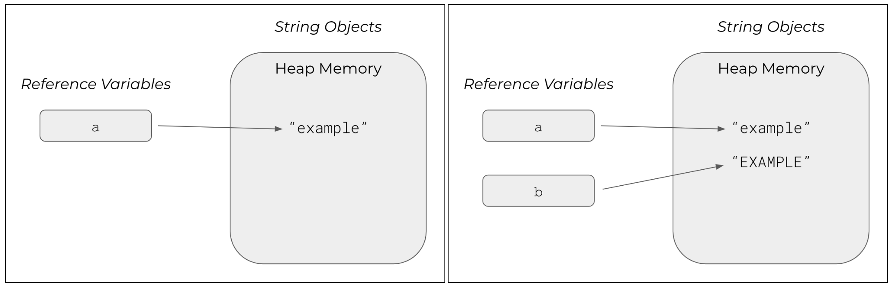
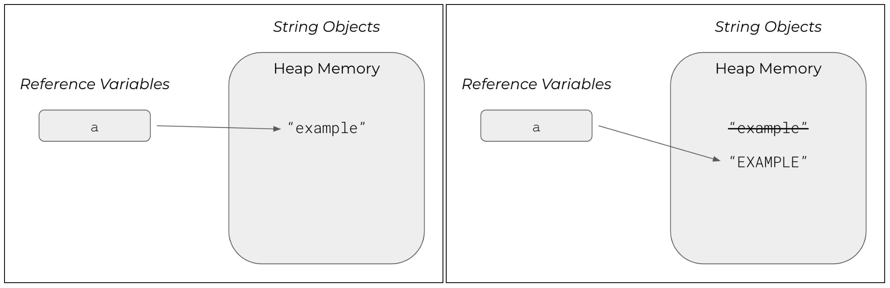
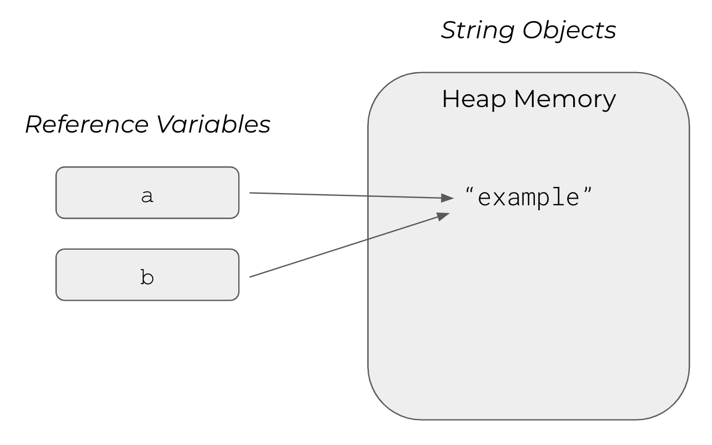

# Strings


* _Core Java: Volume I—Fundamentals_
  * Chapter 3.6


## A Reference Type

In Java, a `String` is a sequence of unicode characters. There is no built-in \(i.e., primitive\) string data type. Instead, it is an object or instance of a built-in Java class \(called `String`\). Rather than a primitive type, `String`s are reference types. All objects \(or instances of classes\) are reference types. Under the hood, the `String` class uses a list of `char`s to represent its data.

### Declaring and Instantiating

You declare and initialize a `String` variable in much the same way you would a primitive one.

```java
dataType variableName;
```

The data type is `String` and the variable name is whatever you'd like. Remember those pesky naming conventions? Yes, they still apply.

```java
String course;
course = "AP Computer Science A";
```

Or, alternatively, you can condense this onto a single line.

```java
String course = "AP Computer Science A";
```

Earlier, you saw that `char` literals needed to be surrounded by single-quotes. `String` literals need to be surrounded by double-quotes. It's how you \(and the compiler\) tells the difference between the two.

Less commonly, you might see a `String` initialized using what is called a constructor. You'll learn all about constructors later in the [Using Objects](../objects-and-classes/object-oriented-programming.md) section. For now, just understand that it is another valid way to create a `String`.

```java
String course = new String("AP Computer Science A");
```

In most cases, you can \(and probably should!\) create `String`s using the double-quotes \(versus the constructor\).

### Using Variables

Just like any other variable or value, you can print its contents to the console using the familiar `println` method. Let's modify the `Hello, World!` program to print the contents of a variable rather than the raw text.


```java
public class HelloWorld {
    public static void main(String[] args) {
        String message = "Hello, world!";
        System.out.println(message);
    }
}
```


This program would behave identically to the original, printing the contents of `message` to the console.

```text
$ java HelloWorld
Hello, world!
```

You can concatenate different `String`s together to form a new `String`. The concatenation operator is the same one used for addition: `+`.

```java
String firstName = "Ryan";
String lastName = "Wilson";
String fullName = firstName + " " + lastName;    // "Ryan Wilson"
```

Now, `fullName` refers to the object `"Ryan Wilson"`, which was derived from the individual `firstName` and `lastName` reference variables \(plus a literal representing a single space\).

## Manipulation

There are a number of methods designed to manipulate `String`s. They are all defined in the `String` class, and are available to you by default. Later, you'll learn about the `String` class and its API in detail in the [Strings, Revisited](../objects-and-classes/strings-revisited.md) section. For now, you should familiarize yourself with a few simple use cases.



### Concatenation

When we concatenate two or more `String`s, we're combining them together into a single `String`. `String`s are immutable in Java, which means you can't change their values once you assign them. This is a tricky concept to wrap your head around.

```java
String message = "Hello, world!";
message = "Goodbye, world.";
```

This works just fine in Java, but doesn't it break the rules of immutability? It would help to have a deeper understanding of what's happening here. 

#### Memory Management

`message` is just a reference. It points to a location in memory. Initially, that place in memory stores the data `"Hello, world!"`. When we reassign the value `"Goodbye, world."` to `message`, we aren't actually modifying the memory that stores `"Hello, world!"`. We're just telling `message` to point somewhere else.

So, what happens to `"Hello, world!"` if it isn't modified, but no variables are referring to it? Well, it gets destroyed! Java keeps track of the pieces of memory created in a program. When there are no more references \(i.e., no variables point to a particular location in memory\), the Garbage Collector \(yes, that's actually what it's called!\) reclaims the memory to be reused. This is a process called automatic memory management.

We'll take a look at a few diagrams in the next few subsections that illustrate this point more clearly. Or, you can jump ahead to a short video on the topic at the end of the [Arrays](arrays.md) section. Anyway, back to concatenation.

```java
String str = "abc";
str = str + "def";        // a now stores "abcdef"
```

See the `+` operator? It's not just for doing math. When used within the context of a `String`, it combines the two `String`s into one. In this case, Java takes the original contents of `str` \(i.e., `"abc"`\) and combines it with `"def"` to form a new `String`. It then redirects `str` to point to a new memory location: the newly created `"abcdef"` `String`. As we discussed, the original `"abc"` `String` is destroyed because it has no more references to it.

### Length

Often times, it is helpful to know how long a particular `String` is. Built right into the class is the `length` method, which returns the number of characters in the `String`.

```java
String letters = "acbd";
int length = letters.length();    // length is 4
```

Later, you'll learn how to use this and methods like it to iterate through each character in a `String` one-by-one.

### Uppercase and Lowercase

If you need to convert a particular `String` to its upper- or lowercase equivalent, there are easy-to-use methods already written for us: `toLowerCase` and `toUpperCase`.

```java
String a = "example";
String b = a.toUpperCase();    // upper is "EXAMPLE"
```

It is important to remember that `String`s are immutable, meaning their contents cannot be changed after creation. You're calling `a.toUpperCase()`, but that doesn't actually impact the value of `a`. It uses the contents of `a` to produce a new object.

The figures below illustrate the reference variables `a` and `b`, as well as the `String` objects to which they refer over the course of the code segment.



Even if you modified the code to reassign the value of `a`, a new `String` object would still be created.

```java
String a = "example";
a = a.toUpperCase();     // a is "EXAMPLE"
```

You would simply be redirecting the reference to another object.



Since there are no references to `"example"`, the JVM would eventually destroy it \(freeing that memory to be used elsewhere in the application\). This is a component of the automatic memory management features of Java called garbage collection.

### Substrings

If you need to capture a smaller segment of a larger `String`, you can use the `substring` method. This is a little more complicated than the previous ones.

```java
String name = "John Smith";
String firstName = name.substring(0, 4);    // firstName is "John"
String lastName = name.substring(5);        // lastName is "Smith"
```

The `substring` method works in one of two ways. If you provide a starting index and an ending index, the method grabs the characters in that range \(not including the ending index\). If you provide only a starting index, the method grabs all characters from that starting index through the end of the `String`.

Suppose you sectioned off each character in `name` into separate boxes. You could then assign a unique numeric index to each character. Internally, this is how Java manages `String` data.

| **J** | **o** | **h** | **n** |  | **S** | **m** | **i** | **t** | **h** |
| :--- | :--- | :--- | :--- | :--- | :--- | :--- | :--- | :--- | :--- |
| _0_ | _1_ | _2_ | _3_ | _4_ | _5_ | _6_ | _7_ | _8_ | _9_ |

When you call `name.substring(0, 4)`, you're requesting all characters from index 0 through index 3 \(remember, the ending index is not included\). And when you call `name.substring(5)`, you're requesting all characters from index 5 through the end of the `String`.

You need to be careful not to reference an index that doesn't exist \(i.e., a negative index or one that exceeds the length of the `String`\). If you do, your program will crash.


```java
public class Substrings {
    public static void main(String[] args) {
        String name = "Ryan";
        String substr = name.substring(2, 7);    // invalid range
        
        System.out.println(substr);
    }
}
```


This program will crash when it reaches the call to `substring` on _Line 6_. The range of indexes provided is invalid because `name` is only four characters long.

## Testing for Equality

You can compare the equality \(or inequality\) of `String`s. The class provides an `equals` method for this purpose. You may be aware of operators that test of equality \(i.e., `==` and `!=`\); however, you shouldn't use these with `String`s \(or any other reference types\). We'll cover these operators in detail in the [If Statements](../control-structures/if-statements.md) section.

```java
String myName = "Ryan";
String yourName = "Samantha";
```

Visually, it's apparent that these two `String`s aren't equal. We can verify this programmatically.

```java
boolean isEqual = myName.equals(yourName);    // false
```

Let's take a look at another example, where the `String` values are the same.

```java
String myName = "Ryan";
String yourNamee = "Ryan";
```

Now, we can test their equality just like we did last time.

```java
boolean isEqual = myName.equals(yourName);    // true
```

### Identity

The `==` and `!=` operators are only used with `String`s when testing their identity \(i.e., determining if they refer to the same object in memory\).

```java
String a = "example";
String b = "example";

boolean haveSameIdentity = (a == b);         // true
boolean haveDifferentIdentity = (a != b);    // false
```

Object creation is relatively expensive, and `String`s are a special type of object in Java. As a performance optimization, Java keeps track of the `String` literals that have been created during the running of a program. When you try to create a new `String`, the JVM first checks if the `String` already exists in the String Literal Pool. If it does, a new reference to it is added; otherwise, a new `String` is created entirely.



Remember, this is only true for `String` literals that have been created using double-quotes. `String`s created using a constructor \(or some other method\) would not have the same identity.

```java
String a = new String("example");
String b = new String("example");

boolean haveSameIdentity = (a == b);
```

This is why it's very important to use the `equals`method when testing equality.

## Special Cases

There are a couple special cases when it comes to `String` values.

* An empty `String`
* A `null String`

An empty `String` is a properly declared and initialized `String` whose length is zero. Empty `String`s can be used just like an other `String`.

```java
String empty = "";    // no content, length 0
```

A `null String` is a different story.

```java
String nonexistent = null;
```

A `null String` is a variable that does not refer to any location in memory. You cannot use any of the `String` methods on a `null String`, or your program will crash.


```java
public class NullStrings {
    public static void main(String[] args) {
        String name = null;
        int length = name.length();
        
        System.out.println(length);
    }
}
```


Since `name` is `null`, you cannot access the `length` method on it. Doing so will cause the program to crash, which you can see if you compile and run this program.

```text
$ java NullStrings
Exception in thread "main" java.lang.NullPointerException
    at NullStrings.main(NullStrings.java:4)
```

## Escape Sequences

An escape sequence is a special set of characters that, when used within a `String`, is displayed as something other than itself. Perhaps the character itself is non-printable, or perhaps its representation conflicts with the syntax of how `String`s are written in Java.



Use this table to reference different escape sequences in Java and the characters they represent.

| **Escape Sequence** | **Description** |
| :--- | :--- |
| `\t` | A tab character. |
| `\b` | A backspace character. |
| `\n` | A newline character. |
| `\r` | A carriage return character. |
| `\f` | A formfeed character. |
| `\'` | A single-quote character. |
| `\"` | A double-quote character. |
| `\\` | A backslash character. |

