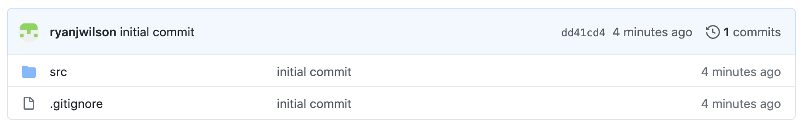

# Problem Set 1

## **Summary**

We'll create our first IntelliJ project, initialize a Git repository, add and commit our project files, create a GitHub repository, and push our files to this remote repository.

## Requirements

1. Create a new IntelliJ project.
2. Create a Java class file called `HelloJava.java`.
3. Write a `main` method in `HelloJava` that prints `Hello, Java!` to the console.
4. Initialize a Git repository in the project folder.
5. Create a `.gitignore` file in the root directory of your project.
6. Add the `.idea` folder, the `out` folder, and any `.iml` files to the `.gitignore` file.
7. Add and commit your `src` folder and `.gitignore` file to version control.
8. Create a remote repository on GitHub called `pset-1`.
9. Push your commit to your remote repository.

## Deliverables

1. Submit your repository URL.

Your repository URL will look something like this: `github.com/your-username/your-repository`. If your username is `jdoe` and your repository \(as indicated in the requirements\) is called `pset-1`, then your URL will be `github.com/jdoe/pset-1`.

Your repository contents should match mine exactly.

## Deadline

All submissions are due on Canvas by 11:59pm on Friday, September 11, 2020.

