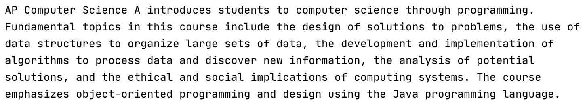

# Problem Set 2

## **Summary**

We'll clone an existing repository, debug an a Java program so that it compiles and runs as expected, and push the corrected code back up to a newly created repository.

## Requirements

1. Clone the `java-skeleton-pset-2` repository.
2. Create a new repository called `pset-2`.
3. Update the remote connections to point at the newly created `pset-2` repository.
4. Fix all compilation errors and bugs in the program.
5. Add, commit, and push the corrected code to the `pset-2` repository.

## Deliverables

1. Submit your repository URL.

After correcting the program, it should output six lines of text with the following content exactly.

## Deadline

All submissions are due on Canvas by 11:59pm on Sunday, September 13, 2020.

