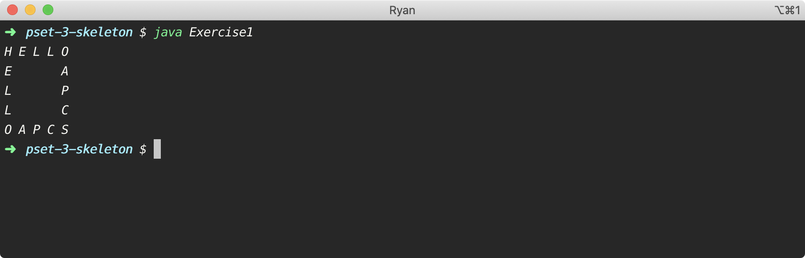
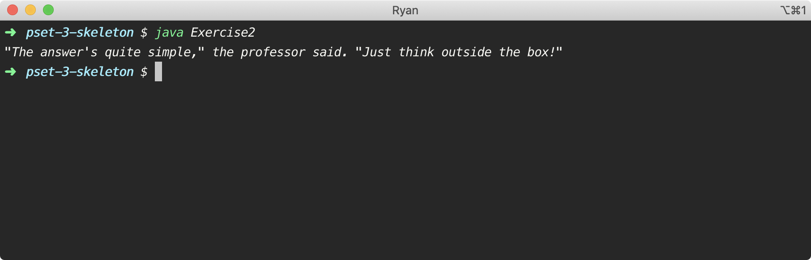

# Problem Set 3

## **Summary**

Solve each exercise so that your output matches the expected output. Each exercise should be written in the `main` method of its own class. Follow a file naming convention of `ExericseX.java`, where `X` is 1 through 10, for each class file.

## Requirements

1. Clone the `java-skeleton-pset-3` repository.
2. Create a new repository called `pset-3`.
3. Solve each of the 10 exercises \(to be self-contained in their own `.java` files\).
4. Add, commit, and push the corrected code to the `pset-3` repository.

## Exercises

The specifications for each exercise are outlined below. Your job is to write code that meets the stated requirements, and matches my output exactly. Work through these exercises on your own. Experiment, make mistakes, ask questions, and fix your mistakes. It's the only way to get good at programming.

### Exercise 1

Print a square of text to the console.

* Use a single `println` statement.
* The use of the `String` concatenation operator is prohibited.

### Exercise 2

Print a simple message to the console.

* Use a single `println` statement.
* The use of the `String` concatenation operator is prohibited.

### Exercise 3

Prompt the user to enter the dimensions of a rectangle \(in inches\). Print the area of the rectangle in square millimeters.

* Always display exactly two decimal places \(rounding, if necessary\).
* Format the square millimeters with separating commas when applicable.
* The use of `if` statements, ternary operators, `switch` statements, and loops is prohibited.

### Exercise 4

Prompt the user to enter the dimensions of a rectangle \(in inches\). Print the perimeter of the rectangle in centimeters.

* Always display exactly two decimal places \(rounding, if necessary\).
* Format the centimeters with separating commas when applicable.
* The use of `if` statements, ternary operators, `switch` statements, and loops is prohibited.

### Exercise 5

A course grading policy defines the following assignment weights.

* Homework, 15%
* Quizzes, 35%
* Tests, 50%

Prompt the user to enter three homework grades, two quiz grades, and one test grade \(all of which must be stored as integer values\). Calculate the user's marking period grade.

* Always display exactly two decimal places \(rounding, if necessary\).
* Format the grade with a percentage sign.
* The use of `if` statements, ternary operators, `switch` statements, and loops is prohibited.

### Exercise 6

Prompt the user for the number of hours per day worked at a local supermarket, as well as the hourly wage. Calculate the weekly gross pay.

* Always display exactly two decimal places \(rounding, if necessary\).
* Format the gross pay with a dollar sign.
* The use of `if` statements, ternary operators, `switch` statements, and loops is prohibited.

### Exercise 7

Prompt the user for their annual salary, as well as the percentage of that salary that is paid into their retirement account \(pre-tax\), deducted for Federal taxes, and deducted for state taxes. Calculate the net pay for a single paycheck if the user is paid twice per month.

* Always display exactly two decimal places \(rounding, if necessary\).
* Format the net pay with a dollar sign.
* The use of `if` statements, ternary operators, `switch` statements, and loops is prohibited.

### Exercise 8

Prompt the use for the number of students and teachers attending a class trip, as well as the capacity of the buses being used. Report the number of buses required, as well as the number of passengers on the last bus.

* The use of `if` statements, ternary operators, `switch` statements, and loops is prohibited.
* The use of the `Math` class is prohibited.

### Exercise 9

Prompt the user to enter a number of dollars. Convert this dollar amount into a number of quarters, dimes, nickels, and pennies. You should always maximize the larger denomination first.

* The use of `if` statements, ternary operators, `switch` statements, or loops is prohibited.

### Exercise 10

Prompt the user to enter a temperature in degrees Fahrenheit Convert that temperature to degrees Celsius, as well as degrees Kelvin.

* Always display exactly two decimal places \(rounding, if necessary\).
* The use of `if` statements, ternary operators, `switch` statements, or loops is prohibited.

## Deliverables

1. Submit your repository URL.

Your program output should match mine exactly for each of the 10 exercises above.

## Deadline

All submissions are due on Canvas by 11:59pm on Sunday, September 20, 2020.

