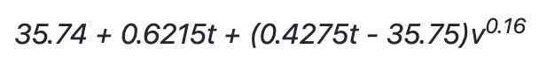

# Problem Set 4

## **Summary**

Solve each exercise so that your output matches the expected output. Each exercise should be written in the `main` method of its own class. Follow a file naming convention of `ExerciseX.java`, where `X` is 1 through 10, for each class file.

## Requirements

1. Create a new repository called `pset-3`.
2. Solve each of the exercises, placing each solution in its own file.
3. Add, commit, and push your code to the `pset-3` repository.

## Exercises

The specifications for each exercise are outlined below. Your job is to write code that meets the stated requirements, and matches my output exactly. Work through these exercises on your own. Experiment, make mistakes, ask questions, and fix your mistakes. It's the only way to get good at programming.

### Exercise 1

According the National Weather Service, wind chill is calculated by the following formula.



Prompt the user to enter a temperature \(in Fahrenheit\) and wind speed \(in MPH\).

* `Temperature :` 
* `Wind speed  :` 

Calculate and print the wind chill.

* Display exactly two decimal places.
* Format the wind chill with separating commas, as needed.
* The use of `if` statements, `switch` statements, ternary operators, and loops is prohibited.

```text
Temperature : 38
Wind speed  : 14

Wind chill  : 29.60
```

### Exercise 2

Prompt the user to enter a number of inches \(ignoring any fractional components\).

* `Inches :` 

Calculate and print the equivalent number of miles, feet, and remaining inches.

* Maximize larger units of distance.
* The use of the `Math` class is prohibited.
* The use of `if` statements, `switch` statements, ternary operators, and loops is prohibited.

```text
Inches : 63387

Miles  : 1
Feet   : 2
Inches : 3
```

### Exercise 3

Prompt the user for the dimensions of a Cornhole board \(in inches\).

* `Length       :` 
* `Width        :` 
* `Diameter     :` 

Calculate and print the surface area of the board \(in square inches\).

* Display exactly two decimal places.
* Format the surface area with separating commas, as needed.
* The use of `if` statements, `switch` statements, ternary operators, and loops is prohibited.

```text
Length       : 48
Width        : 24
Diameter     : 6

Surface area : 1,123.73
```

### Exercise 4

Prompt the user to enter a number of centimeters \(ignoring any fractional components\).

* `Centimeters :` 

Calculate and print the equivalent number of kilometers, meters, and remaining centimeters.

* Maximize larger units of distance.
* The use of the `Math` class is prohibited.
* The use of `if` statements, `switch` statements, ternary operators, and loops is prohibited.

```text
Centimeters : 100203

Kilometers  : 1
Meters      : 2
Centimeters : 3
```

### Exercise 5

Prompt the user to enter a diameter of a circle.

* `Diameter      :` 

Calculate the area and circumference of the circle.

* Display exactly two decimal places.
* Format the area and circumference with separating commas, as needed.
* The use of `if` statements, `switch` statements, ternary operators, and loops is prohibited.

```text
Diameter      : 10

Area          : 78.54
Circumference : 31.42
```

### Exercise 6

Prompt the user to enter a length and width of a rectangle.

* Length:
* Width:

Calculate and print the area, perimeter, and diagonal of the rectangle.

* Display exactly two decimal places.
* Format the area, perimeter, and diagonal with separating commas, as needed.
* The use of `if` statements, `switch` statements, ternary operators, and loops is prohibited.

```text
Length    : 5
Width     : 10

Area      : 50.00
Perimeter : 30.00
Diagonal  : 11.18
```

### Exercise 7

Prompt the user to enter a side length of a hexagon.

* `Side      :` 

Calculate and print the area and perimeter of the corresponding hexagon.

* Display exactly two decimal places.
* Format the area and perimeter with separating commas, as needed.
* The use of `if` statements, `switch` statements, ternary operators, and loops is prohibited.

```text
Side      : 5

Area      : 64.95
Perimeter : 30.00
```

### Exercise 8

Prompt the user to enter a sequence of text.

* `Text :` 

Reverse the first and second halves of the `String`, making sure each letter is capitalized.

* The use of `if` statements, ternary operators, `switch` statements, and loops is prohibited.

```text
Text : apcsa

CSAAP.
```

### Exercise 9

Prompt the user to enter their first, middle, and last names.

* `First name  :` 
* `Middle name :` 
* `Last name   :` 

Print their initials in all capital letters.

* The use of `if` statements, ternary operators, `switch` statements, and loops is prohibited.

```text
First name  : john
Middle name : fitzgerald
Last name   : kennedy

JFK.
```

### Exercise 10

Prompt the user to enter their favorite city.

* `What's your favorite city?` 

Print the original `String`, its length, and the capital and lowercase equivalents of the `String`.

* The use of `if` statements, ternary operators, `switch` statements, and loops is prohibited.

```text
What's your favorite city? Los Angeles

Text   : Los Angeles
Length : 11
Upper  : LOS ANGELES
Lower  : los angeles
```

## Deliverables

1. Submit your repository URL.

Your program output should match mine exactly for each of the exercises above.

## Deadline

All submissions are due on Canvas by 11:59pm on Sunday, October 4, 2020.

